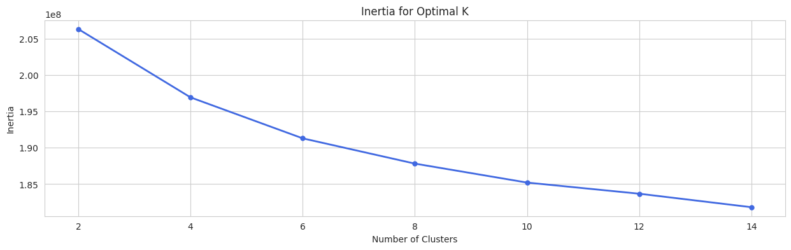
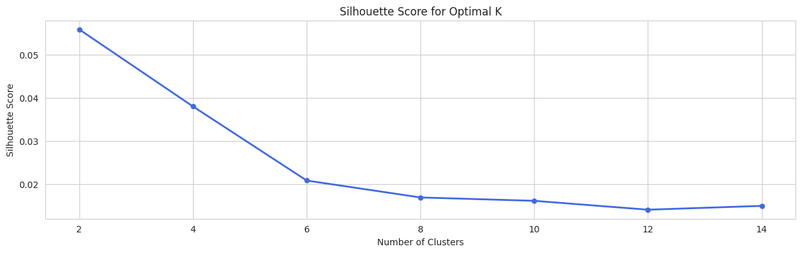
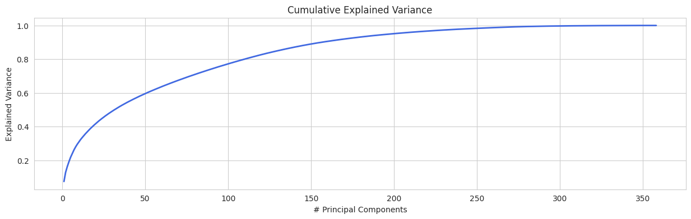
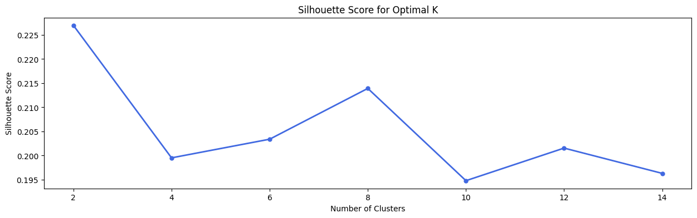
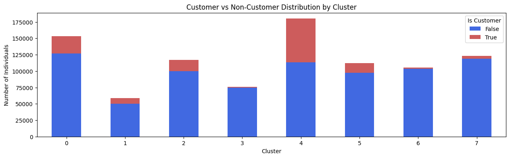

# Section 1: Project Definition

## Project Overview
The project aims to enhance Bertelsmann's understanding of its customer base through a comprehensive data analysis framework. It is divided into three key components:
1. **Data Exploration:** This initial phase focuses on identifying and addressing data quality issues within the provided demographic data. By cleaning and refining the dataset, the project ensures that subsequent analyses are based on accurate and reliable information.
2. **Customer Segmentation with Unsupervised Model:** An unsupervised machine learning model is employed to categorize individuals into distinct segments based on their behaviors and characteristics, allowing the company to uncover distinct customer traits and behaviors.
3. **Customer Prediction with Supervised Model:** A supervised machine learning model is utilized to predict future customers, enabling Bertelsmann to effectively target future mailout campaigns based on demographic data.

Overall, the project seeks to leverage data-driven insights to support more effective marketing and customer relationship strategies.

## Problem Statement
The primary problem to solve is to identify and predict potential customers for future mailout campaigns and to better understand the traits and behaviors of existing customers.

## Metrics
### Customer Segmentation
For customer segmentation, silhouette scores are used to measure the quality of clusters. Silhouette scores measure how similar a point is to its own cluster compared to other clusters, balancing both cohesion and separation. A high average silhouette score indicates well-defined, distinct clusters, making it a reliable diagnostic when ground truth labels are unavailable.

### Customer Prediction Model
For customer prediction, ROC AUC are used as the evaluation metric, because it seems to be the best fit for the business problem:
- offers a comprehensive evaluation of model performance by assessing the trade-off between recall and false positive rate across different thresholds
- maximizing recall (true positive rate) is essential to identify as many potential customers as possible
- control false positive rate is also crucial to avoid spamming uninterested users and protect brand reputation

# Section 2: Analysis

## Data Exploration
The initial phase involved exploring the demographic population datasets to identify data quality issues. Key findings include:

- **Data Types:** The datasets contained numeric and string types. String types such as `cameo_deu_2015` or `ost_west_kz` should be treated as categorical variables. Moreover, some numeric attributes are not ordinal (no perceived order) and should be handled as a categorical feature too, e.g. `finanztyp` or `shopper_typ`.

- **Unknown & Invalid Values:** Unknown and invalid values were identified based on the provided meta information and should be treated as missing data.

- **Missing Data (Record-Level):** Around 12% of all data records have more than 120 missing attributes (so over one third of the features), which should be removed due to the lack of information.

- **Missing Data (Feature-Level):** 14 attributes have a missing value ratio over 20% and should be completely dropped, because an uncertain imputation for that amount of data will possibly create too much bias. Some features like `ager_type` or `titel_kz` have a high missing ratio due to its logical nature and can be imputed purposeful. The remaining attributes have a max missing ratio of 7.5%, which can be kept in the dataset and impute the null values with its median for numeric types and mode for strings.

- **Feature Extraction:** `praegende_jugendjahre` (formative youth years) and `cameo_intl_2015` (social typology) are both compositions of multiple information and should be separated into multiple features.

- **Feature Correlation:** Various highly correlated features were identified such as `lp_status_fein` and `lp_status_grob`. Redundant features should be dropped to reduce dimensionality.

- **General Population vs. Customer Dataset:**
  - The customer dataset have 3 additional columns `customer_group`, `online_purchase` and `product_group`, which should be dropped to align the datasets.
  - There is one value in `gebaeudetyp` (categorical feature), that is only in the population dataset and therefore creates the corresponding dummy column only in the population dataset.
  - The share of records with more than one third of missing data is considerably higher in the customer dataset: 26.8% vs. 11.9%
  - The share of records with nearly complete data instead is higher in the customer dataset, e.g. less than 10 missing features: 59.9% vs. 48.6%
  - The customer data has a slightly lower share of features that contain more than 20% missing values: 2.8% vs. 5.5%
  - The missing ratios per feature between both datasets are mostly quite close, because the correlation is with 0.94 very high.

## Data Visualization
Several visualizations were created to better understand the datasets:

- **Missing Data (Record-Level):** The distribution of missing values per record in both population and customer datasets is helpful to observe the amount of missing data on the record-level and how the deviate compared to the other dataset.
    
  Population Dataset:
  
    
  Customer Dataset:
  

- **Missing Data (Feature-Level):** The missing values ratio per feature compared between both datasets shows, that they are quite similar for most of the features.
    
  

- **Feature Correlation:** The correlation matrix shows clearly the high correlations between some redundant features.
    
  

# Section 3: Methodology

## Data Preprocessing
Data preprocessing was a crucial step to ensure data quality and reliability for subsequent analyses. The revealed data issues from the initial data exploration were handled properly. The preprocessing involved several tasks:

- **Rectify Meta Attributes:** Attribute names in the metadata were aligned to match them with the demographic datasets.

- **Convert Unknown & Invalid Values:** Values that are out of range or marked as unknown in the meta information were converted to actual null values.

- **Remove Records / Features:** Records and features with too many missing values (records: > 33%, features: > 20%) were removed, due to the lack of information. 

- **Impute Missing Values:** The remaining missing data were imputed using median for numeric features and mode for categorical features.

- **Feature Engineering:** New features were extracted from existing ones (formative youth years and international social classifications)

- **Remove Uncertain Features:** Some features in the datasets have no provided meta information and could not be classified by their name or their values. Therefore, it is unclear weather to handle them as numeric or categorical feature.

- **Remove Redundant Features:** Highly correlated features were removed to reduce dimensionality.

- **Encoding:** All features were screened and classified as numeric or categorical. One-Hot-Encoding were applied to categorical features. Binary features were also standardized to 0/1.

- **Align Features:** Small deviations in the missing values between the population and customer dataset leads to different feature removals. Moreover, some categorical values are only in one of the datasets. Therefore, we have to ensure the same features in the same order for both datasets.

- **Scaling:** Numeric features will be standardized using the StandardScaler.

## Implementation

### Customer Segmentation

**K-Means Clustering**

K-Means were used for clustering, which partitions data into a predefined number of clusters by minimizing the distance between data points and their respective cluster centroids. 
It iteratively updates the centroids and reassigns points until the clusters stabilize. 
K-Means is a good choice for our customer segmentation because it is simple, efficient on large datasets, and often produces well-separated, interpretable clusters.

**Optimal Number of Clusters**

Since K-Means requires a predefined number of clusters, it is important to determine the optimal number for our dataset.
Common techniques for this are the elbow method and the silhouette score. To apply these techniques, different numbers of clusters were tested first and collect the corresponding results.

For the elbow method we have to plot the within-cluster sum of squares (WCSS or Inertia) against the number of clusters and identifying the "elbow point".
Unfortunately, the elbow curve did not provide a definitive indication of the optimal number of clusters, suggesting potential issues with cluster separation.

The silhouette score also was notably low with 0.05 as the highest value for 2 clusters, indicating poor cluster cohesion and separation.

**Principal Component Analysis**

Principal Component Analysis (PCA) is a dimensionality reduction technique that transforms high-dimensional data into a lower-dimensional form while preserving as much variance as possible.

PCA is essential for K-Means clustering, because it helps eliminate noise and irrelevant features that can mislead the clustering process. This is why PCA can improve the accuracy and stability of K-Means clustering results.

The explained variance in PCA refers to the amount of the total variance in the data that is captured by each principal component. It indicates how much information from the original data is preserved by that component.

After PCA was applied while retaining 90% of the explained variance (resulting in 156 principal components), the silhouette score improved just marginally to 0.07. 

Therefore, further investigation was necessary, which are covered in the refinement section below.

### Customer Prediction
- binary classification model
- robust model for class imbalance
- gradient boosting decision trees: xgboost with early stopping
- training curves to evaluate over-/underfitting
- find threshold by balancing trade-off between recall and FPR, but with domain-specific considerations
- first used AUCPR, but ...

## Refinement

### Customer Segmentation
Reducing PCA explained variance to 0.3 resulted in a better silhouette score of 0.16, although the clustering quality remains suboptimal.

The additional removal of the `d19` and `kba` features significantly reduced the dataset's dimensionality prior to applying PCA.
That approach in combination with an explained variance of 0.5 (resulted in 7 principal components) delivered the best silhouette score results. This will be discussed further in the model evaluation in section 4.

### Customer Prediction
- Hyperparameter Tuning
- scale_pos_weight adjustments

# Section 4: Results

## Model Evaluation and Validation

### Customer Segmentation
After the refinement of the explained variance and further dimensionality reduction, we achieved a silhouette score of over 0.21 after all. 
This is still quite low, but could be sufficient for a basic customer segmentation.

We reached the highest scores for 2 and 8 clusters. For our customer segmentation we took the more granular clusters, where we identified a customer-heavy cluster. 
This cluster (number 4) stands out with a proportion of 37% and is an appropriate base to gain insights about the customer characteristics based on that cluster.

**Finding Cluster Traits Part I: Principal Components Approach**

The cluster traits were examined by its principal components to get an idea of how the cluster is positioned along each principal component.
Component #1 was clearly above the average, while component #3 was noticeably below.

Each principal component is a linear combination of the original variables. The loadings indicate how much each original variable contributes to each principal component. The sign of the loading (positive or negative) indicates the direction of the relationship.

The loadings of component #1 indicates relationships to these features:
- `lp_status_fein` - higher social status
- `finanz_minimalist` - higher financial interest
- `mobi_regio` - lower mobility
- `plz8_antg1` - higher share of 1-2 family houses
- `plz8_antg2` - less share of 3-5 family houses
- `konsumnaehe` - higher distance from building to Point of Sale
- `innenstadt` - higher distance to city center
- `zabeotyp` - consume more smart and green energy

This cluster of individuals could possibly be described as affluent, stable homeowners who live in rural or suburban areas. They exhibit higher social status through homeownership and top earnings, demonstrate a strong financial awareness, and prefer single-family homes. With lower mobility and greater distances from urban centers and points of sale, they value a quieter lifestyle. Additionally, they show a commitment to sustainability by consuming more smart and green energy, reflecting their environmentally conscious mindset.

- Cluster Profile analyzed by
  - Loadings of PCA Components with high cluster impact
  - Original Values (cluster vs. population)
- intersections between PCA Loading and Original Values

### Customer Prediction
- no sign of over-/underfitting by evaluating logloss curves
- early stopping AUC
- AUC good, can appropriately distinguish between customers and non-customers

## Justification

### Customer Segmentation
- original values preferred over PCA Loadings if available
- used both techniques to get a sense for the intersections and to substantiate the results
- customer profile seems coherent (no contradictions)

### Customer Prediction
- slow "learning rate" is key
- ROC curve discussion
- Threshold determination