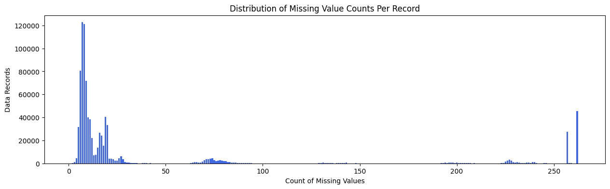
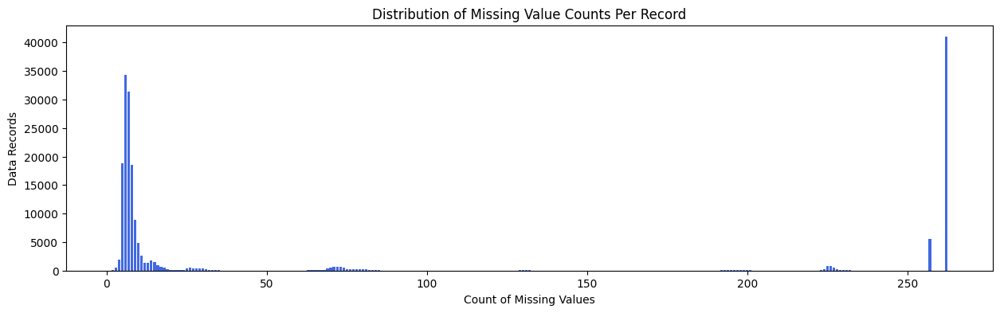
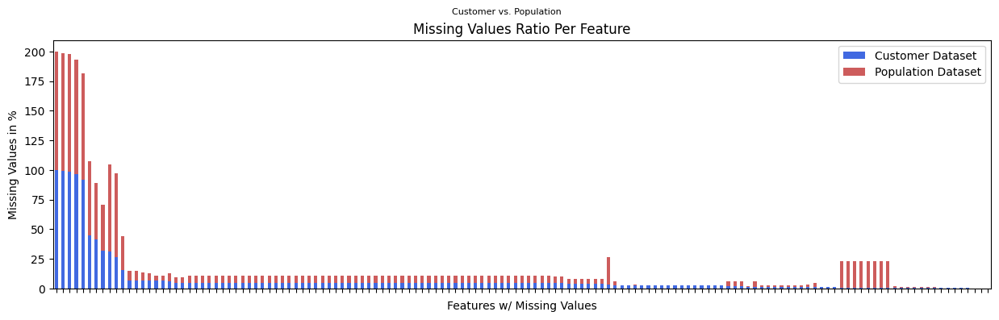
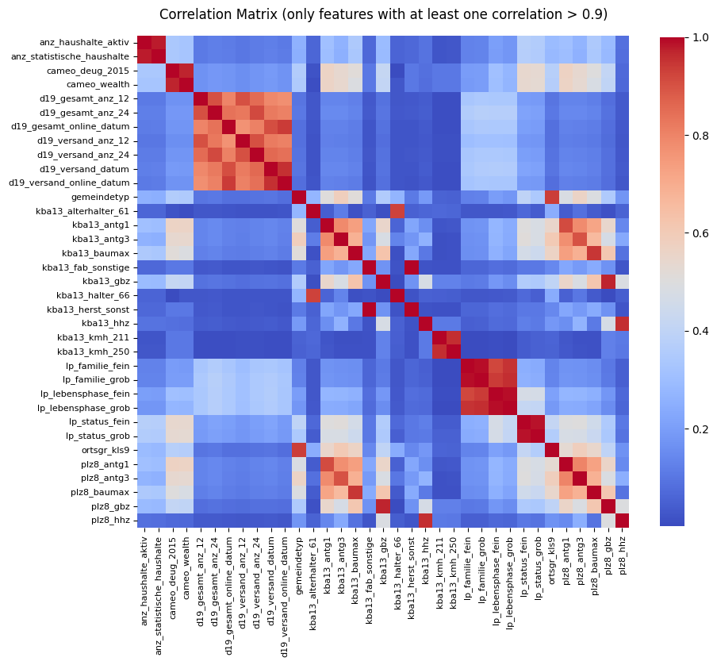

# Section 1: Project Definition

## Project Overview
The project aims to enhance Bertelsmann's understanding of its customer base through a comprehensive data analysis framework. It is divided into three key components:
1. **Data Exploration:** This initial phase focuses on identifying and addressing data quality issues within the provided demographic data. By cleaning and refining the dataset, the project ensures that subsequent analyses are based on accurate and reliable information.
2. **Customer Segmentation with Unsupervised Model:** An unsupervised machine learning model is employed to categorize individuals into distinct segments based on their behaviors and characteristics, allowing the company to uncover distinct customer traits and behaviors.
3. **Customer Prediction with Supervised Model:** A supervised machine learning model is utilized to predict future customers, enabling Bertelsmann to effectively target future mailout campaigns based on demographic data.

Overall, the project seeks to leverage data-driven insights to support more effective marketing and customer relationship strategies.

## Problem Statement
The primary problem to solve is to identify and predict potential customers for future mailout campaigns and to better understand the traits and behaviors of existing customers.

## Metrics
### Customer Segmentation
For customer segmentation, silhouette scores are used to measure the quality of clusters. Silhouette scores measure how similar a point is to its own cluster compared to other clusters, balancing both cohesion and separation. A high average silhouette score indicates well-defined, distinct clusters, making it a reliable diagnostic when ground truth labels are unavailable.

### Customer Prediction Model
For customer prediction, ROC AUC are used as the evaluation metric, because it seems to be the best fit for the business problem:
- offers a comprehensive evaluation of model performance by assessing the trade-off between recall and false positive rate across different thresholds
- maximizing recall (true positive rate) is essential to identify as many potential customers as possible
- control false positive rate is also crucial to avoid spamming uninterested users and protect brand reputation

# Section 2: Analysis

## Data Exploration
The initial phase involved exploring the demographic population datasets to identify data quality issues. Key findings include:

- **Data Types:** The datasets contained numeric and string types. String types such as `cameo_deu_2015` or `ost_west_kz` should be treated as categorical variables. Moreover, some numeric attributes are not ordinal (no perceived order) and should be handled as a categorical feature too, e.g. `finanztyp` or `shopper_typ`.

- **Unknown & Invalid Values:** Unknown and invalid values were identified based on the provided meta information and should be treated as missing data.

- **Missing Data (Record-Level):** Around 12% of all data records have more than 120 missing attributes (so over one third of the features), which should be removed due to the lack of information.

- **Missing Data (Feature-Level):** 14 attributes have a missing value ratio over 20% and should be completely dropped, because an uncertain imputation for that amount of data will possibly create too much bias. Some features like `ager_type` or `titel_kz` have a high missing ratio due to its logical nature and can be imputed purposeful. The remaining attributes have a max missing ratio of 7.5%, which can be kept in the dataset and impute the null values with its median for numeric types and mode for strings.

- **Feature Extraction:** `praegende_jugendjahre` (formative youth years) and `cameo_intl_2015` (social typology) are both compositions of multiple information and should be separated into multiple features.

- **Feature Correlation:** Various highly correlated features were identified such as `lp_status_fein` and `lp_status_grob`. Redundant features should be dropped to reduce dimensionality.

- **General Population vs. Customer Dataset:**
  - The customer dataset have 3 additional columns `customer_group`, `online_purchase` and `product_group`, which should be dropped to align the datasets.
  - There is one value in `gebaeudetyp` (categorical feature), that is only in the population dataset and therefore creates the corresponding dummy column only in the population dataset.
  - The share of records with more than one third of missing data is considerably higher in the customer dataset: 26.8% vs. 11.9%
  - The share of records with nearly complete data instead is higher in the customer dataset, e.g. less than 10 missing features: 59.9% vs. 48.6%
  - The customer data has a slightly lower share of features that contain more than 20% missing values: 2.8% vs. 5.5%
  - The missing ratios per feature between both datasets are mostly quite close, because the correlation is with 0.94 very high.

## Data Visualization
Several visualizations were created to better understand the datasets:

- **Missing Data (Record-Level):** The distribution of missing values per record in both population and customer datasets is helpful to observe the amount of missing data on the record-level and how the deviate compared to the other dataset.
    
  Population Dataset:
  
    
  Customer Dataset:
  

- **Missing Data (Feature-Level):** The missing values ratio per feature compared between both datasets shows, that they are quite similar for most of the features.
    
  

- **Feature Correlation:** The correlation matrix shows clearly the high correlations between some redundant features.
    
  
